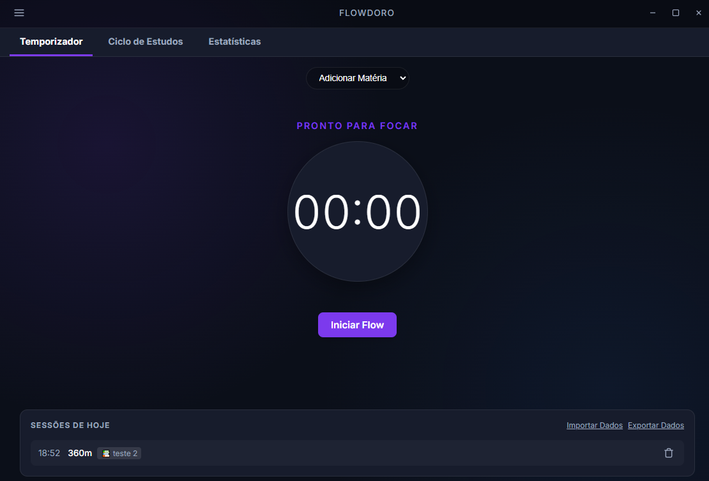

# Flowdoro

O **Flowdoro** é um aplicativo desktop para Windows, construído sob medida para estudantes e concurseiros que buscam máxima produtividade. Unindo a poderosa técnica **Flowtime** ao renomado **Ciclo de Estudos flexível**, a ferramenta permite que você estude no seu próprio ritmo, sem a rigidez de cronogramas fixos, mantendo a proporção ideal entre horas dedicadas e pausas restauradoras.



## Principais Funcionalidades

### Temporizador Flowtime Inteligente
Diferente da técnica Pomodoro clássica (25 min fechados), o método Flowtime abraça o seu "estado de flow".
- Estude até sua concentração naturalmente acabar.
- Defina pausas baseadas na porcentagem do tempo produtivo (por padrão, 20% do tempo focado = tempo de descanso, totalmente personalizável nas Configurações).

### Planejador de Ciclo de Estudos Flexível
Abandone grades horárias de Segunda a Sexta que quebram ao menor imprevisto.
- Insira as suas Matérias, definindo **Peso**, **Dificuldade** e **Quantidade de Conteúdo** (fórmula D+V+P).
- Defina a carga total do ciclo (ex: 40 horas). O Flowdoro calculará automaticamente a distribuição matemática ideal do seu tempo.
- Veja a barra de progresso encher em bloquinhos de 1-Hora conforme as suas sessões terminam!
- Adicione tempo manual, caso estude pelo celular ou por fora do PC.

### Painel de Estatísticas
- Gráfico de pizza interativo mostrando nativamente como está sendo distribuída a proporção macro do seu tempo nas matérias ao longo do tempo.

### Personalização Extrema e Theming
Diferente do trivial, estude com a interface mais confortável aos olhos:
- Tema **Padrão** (Dark mode com tons de azul profundo e roxo estético).
- Tema **AMOLED** (Preto 100% puro para focar no conteúdo).
- Tema **Claro** (Modo luminoso e limpo).
- Seletor de Cores Dinâmicas e Emojis customizados para cada disciplina.

### Privacidade e Persistência
- Todos os seus históricos de sessão e matérias são salvos no seu próprio PC.
- Exporte o backup (`.json`) para nunca perder seu progresso.
- Funcionalidade "Iniciar Novo Ciclo", que cria um arquivo vitalício (histórico offline de ciclos passados) e limpa a grade atual.

---

## Como Executar o Projeto Localmente

**O arquivo executável (.exe) otimizado e pronto para uso está disponível na aba de Releases do repositório.** Caso prefira rodar ou compilar o projeto do zero:

O Flowdoro foi desenvolvido com uma stack moderna de alta performance: **React 18**, **TypeScript**, **Vite** e empacotado para o desktop via **Electron**.

### 1. Pré-Requisitos
Certifique-se de ter o [Node.js](https://nodejs.org/) (versão LTS recomendada) instalado.

### 2. Instalações e Build
Clone o repositório, navegue até o diretório e execute:

```bash
# 1. Instale as dependências
npm install

# 2. Rode localmente em ambiente de Desenvolvimento
npm run dev

# 3. Empacotando para Windows (.exe)
npm run build
```

*Bons estudos!*
